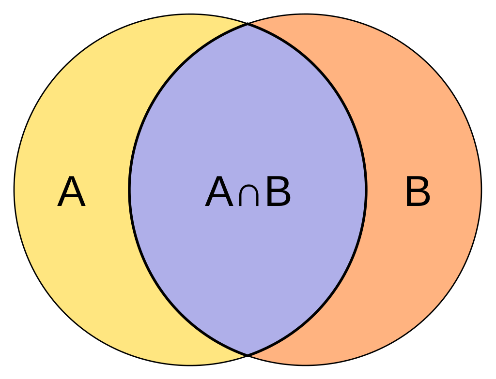
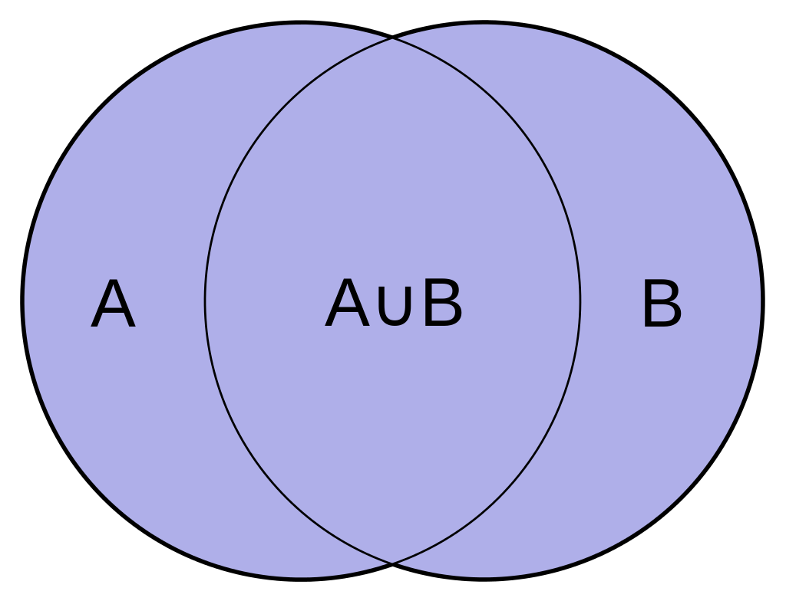

```{r setup, include=FALSE}
knitr::opts_chunk$set(echo = TRUE)
```

```{r, message = F}
library(tidyverse)
library(igraph)
```

When it comes to recommendation systems, the [MovieLens](https://movielens.org/) data set is the standard practice set to play with. Let's see what we can do. 

```{r, message = F}
movies <- read_csv('ml-latest-small/movies.csv')
ratings <- read_csv('ml-latest-small/ratings.csv')
```

Let's take a small look at what we have:

```{r}
head(movies)

head(ratings)
```

We will model the graph to have edges leave from users and point towards movie titles.

```{r}
#people -[like]-> movies
g <- ratings %>%
  left_join(movies, by = 'movieId') %>%
  select(userId, title, rating) %>%
  graph_from_data_frame() %>%
  {
    .$name <- 'MovieLens Ratings';
    .$author <- "University of Minnesota's GroupLens Research Group";
    . #return graph
  }

g
```

Let's choose a random person to recommend movies to. 

```{r}
person_of_interest <- '1'
```

A node's **ego** is the subnetwork centered around it. Because we are working with a bipartite graph, all nodes surrounding user nodes represent all the movies that they rated. 

```{r}
ego(g, order = 1, nodes = person_of_interest, mode = 'all', mindist = 0)
```

Remember, we cannot use vertices from one graph to filter another graph. An ego is it's own graph. However, if we take away the names, then we can filter the original graph by matching the **name** attribute with the extracted character vector.

```{r}
poi_ego <- g %>%
  ego(nodes = person_of_interest) %>%
  .[[1]] %>%
  {g - V(g)[!name %in% .$name]}

poi_ego
```

  
```{r}
#all movies person of interest likes
poi_movies <- poi_ego %>%
  head_of(graph = ., es = E(.)) %>% #where are the edges pointing to?
  unique %>%
  .$name

head(poi_movies)
```

Now that we have all the movies our person of interest rated, we can use that information to find similar users. We will measure similarity by using the **Jaccard Similarity** metric. This is calculated by dividing the number of neighboring nodes two nodes share dby the total number of neighboring nodes for both of them. 

```{r, echo = F, out.width='250px'}
# https://en.wikipedia.org/wiki/Jaccard_index


knitr::include_graphics('img/Intersection_over_Union_-_poor,_good_and_excellent_score.png')
```


```{r}
simscore <- similarity(g, mode = 'out')

simscore[1:5, 1:5]
```


```{r}
#Who are similar people?
poi_sim <- g %>% 
  {
    #how similar are nodes to our person of interest?
    V(.)$simscore <- simscore[V(.)$name == person_of_interest];
    .;
  } %>%
  #remove person of interest
  {. - V(.)[name == person_of_interest]} %>%
  #remove movies the person of interest already saw
  {. - V(.)[name %in% poi_movies]} 
```

We want to compare movies between two users that are actually similar to eachother, so we will need to create a cutoff point we decide upon.

```{r}
#pull just the people
raters <- poi_sim %>%
  tail_of(., E(.)) %>%
  unique() 

raters

#make a cutoff to determine who are similar enough to poi
q3 <- quantile(raters$simscore, .95)

q3
```

Now, we can filter out people we declare are not similar to our person of interest and then select moves that person of interest has not rated yet. 

```{r}
poi_sim <- poi_sim %>%
  #remove people who are not similar to person of interest
  {
    allnames <- ego(. , nodes = V(.)[simscore > q3]) %>% #returns list
      unlist %>% #returns a vector of vertices
      names %>%
      unique

    . - V(.)[!name %in% allnames]
  } %>%
  #create metrics for movies
  {
    #degree is the sum of edges
    #strength is a the sum of edge attributes
    rate_score <- strength(., weights = E(.)$rating)/degree(.);
    V(.)$rate_score <- rate_score;
    V(.)$degree <- degree(.)
    . - tail_of(., E(.));
  }
```

```{r}
poi_sim %>% 
  as_data_frame('vertices') %>% 
  filter(degree > 5) %>% 
  arrange(desc(rate_score)) %>%
  head(10) %>%
  select(-simscore) #simscore was used only to rate people
```


## Yeah, but does it work?


```{r}
#let's get top movies 
poi_top <- poi_ego %>%
  {
    q3 <- quantile(E(.)$rating, .75);
    . - E(.)[rating < q3]
  } %>%
  head_of(E(.)) %>%
  .$name %>%
  head(20)

poi_top 
```

```{r}
recommend_movies <- function(g, person_of_interest){
  poi_ego <- g %>%
    ego(nodes = person_of_interest) %>%
    .[[1]] %>%
    {g - V(g)[!name %in% .$name]}
  
  poi_movies <- poi_ego %>%
    head_of(graph = ., es = E(.)) %>% 
    unique %>%
    .$name
  
  simscore <- similarity(g, mode = 'out')

  poi_sim <- g %>% 
    {
      V(.)$simscore <- simscore[V(.)$name == person_of_interest];
      .;
    } %>%
    {. - V(.)[name == person_of_interest]} %>%
    {. - V(.)[name %in% poi_movies]} 

  raters <- poi_sim %>%
    tail_of(., E(.)) %>%
    unique() 
  
  q3 <- quantile(raters$simscore, .95)

  poi_sim <- poi_sim %>%
    {
      allnames <- ego(. , nodes = V(.)[simscore > q3]) %>% 
        unlist %>% 
        names %>%
        unique
  
      . - V(.)[!name %in% allnames]
    } %>%
    {
      rate_score <- strength(., weights = E(.)$rating)/degree(.);
      V(.)$rate_score <- rate_score;
      V(.)$degree <- degree(.)
      . - tail_of(., E(.));
    } %>% 
    as_data_frame('vertices') %>%
    arrange(desc(rate_score))
}
```
```{r}
poi_test <- g %>%
  {. - E(.)[person_of_interest %--% poi_top]} %>%
  recommend_movies(person_of_interest)
```

```{r}
poi_test %>%
  filter(degree > 5) %>% 
  .$name %>%
  head(40) %>%
  {. %in% poi_top} %>% 
  table
```
